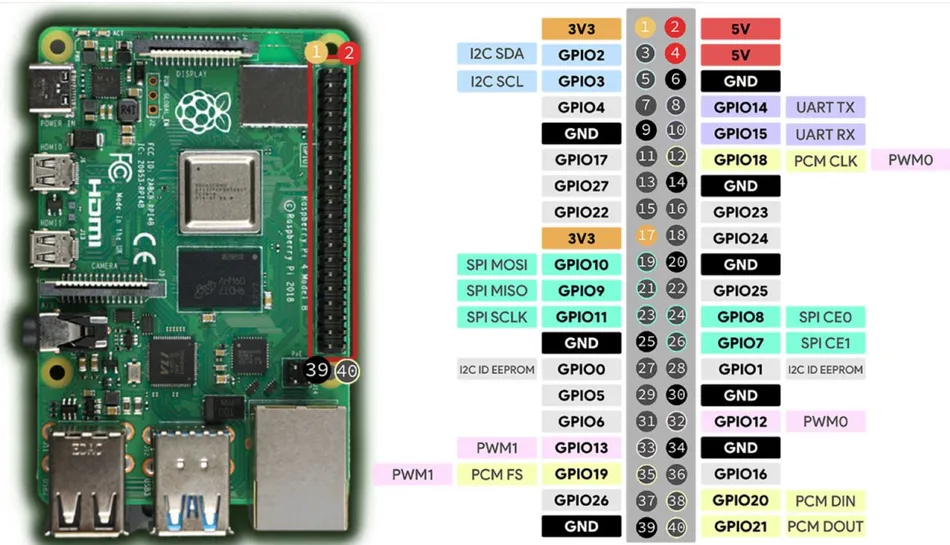

# Sistema Inteligente de Aforo :D

Guia de instalacion para Raspberry Pi 3B, 4B y 5.

Cada version de Pi tiene su propia carpeta en el repositorio
con los scripts de instalacion adaptados:

```
Proyecto2-Contador_Personas_PUCP/
├── Proyecto_aforo_reducido_github_v3/      <- Pi 3B y 4B
│   ├── instalar_dependencias.sh            <- usa RPi.GPIO
│   └── ...
│
└── Proyecto_aforo_reducido_github_v4_pi5/  <- Pi 5
    ├── instalar_dependencias.sh            <- usa lgpio
    └── ...
```

Las diferencias entre versiones son:
- `boot_manager.py` -> Pi 3B/4B usa RPi.GPIO, Pi 5 usa lgpio
- `aforo/web/app.py` -> Pi 3B/4B usa RPi.GPIO, Pi 5 usa lgpio
- `instalar_dependencias.sh` -> instala la libreria GPIO correspondiente

Todo lo demas es identico entre versiones.

---

## Estructura del proyecto

```
/home/pi/proyecto_aforo/
│
├── instalar_dependencias.sh
├── instalar_servicios.sh
├── README.md
│
├── afov/                          <- venv Python (se crea con instalar_dependencias.sh)
│
├── aforo/
│   ├── boot_manager.py
│   ├── config.json                <- generado automaticamente
│   ├── config_manager.py
│   ├── counter.py
│   ├── geometry.py
│   ├── main.py
│   ├── main_debug.py
│   ├── my_botsort.yaml
│   ├── my_bytetrack.yaml
│   ├── tracker.py
│   │
│   ├── web/
│   │   ├── app.py
│   │   ├── static/
│   │   │   ├── app.js
│   │   │   ├── icon.png
│   │   │   └── style.css
│   │   └── templates/
│   │       └── index.html
│   │
│   └── best_640_ncnn_model/
│
└── services/
    ├── aforo-engine.service
    ├── aforo-web.service
    └── wlan-static-ip.service
```

---

## Hardware


- Raspberry Pi 3B, 4B o 5
- LED azul en GPIO 24
- Boton en GPIO 27 (pull-up, presionado = LOW)
- UART en GPIO 14 y 15, utiles para pasar la informacion obtenida
- Camara compatible con V4L2
- Cable RJ45 para conexion punto a punto con PC

> NOTA Pi5: el chip GPIO es diferente al de Pi3/Pi4. Por eso
> boot_manager.py usa lgpio en lugar de RPi.GPIO. Si conectas
> un AI HAT+ u otro HAT de 40 pines, los pines GPIO siguen
> accesibles por el conector pass-through en la parte superior del HAT.

Comando para ver el log de los servicios
´´´bash
journalctl -u aforo-engine.service -f --output=cat
´´´´
---

## Requisitos previos

### Flashear la SD (en tu PC)

Usar Raspberry Pi Imager con Raspberry Pi OS Lite 64-bit y configurar:

| Parametro  | Valor            |
|------------|------------------|
| Hostname   | aforo            |
| Usuario    | pi               |
| Contrasena | aforo            |
| WiFi       | Red disponible   |
| SSH        | Habilitado       |
| VNC        | Opcional         |

---

## Como obtener la IP de la Pi y configurar conexion permanente

El objetivo es configurar una IP estatica por ethernet para que
siempre puedas conectarte con `ssh pi@aforo.local` sin depender
de WiFi ni de monitor. Solo necesitas hacerlo una vez.

### Opcion A - Acceso fisico (monitor + teclado)

1. Conectar monitor, teclado y mouse a la Pi y encenderla
2. Entrar al sistema y ver la IP que le asigno el WiFi:
```bash
ip addr show wlan0
```
3. Desde esa misma terminal configurar IP estatica en ethernet:
```bash
sudo nmcli con add type ethernet ifname eth0 con-name eth-static ipv4.method manual ipv4.addresses "192.168.0.10/24"
sudo nmcli con up eth-static
```
4. Activar VNC si quieres acceso grafico remoto:
```bash
sudo raspi-config
# Interface Options -> VNC -> Yes
```
5. Configurar tu PC como se indica abajo
6. Ya puedes desconectar monitor y teclado, nunca mas los necesitas

### Opcion B - Punto de acceso del celular (sin monitor)

1. Crear un AP en tu celular con el mismo SSID y contrasena
   que configuraste en Pi Imager
2. Encender la Pi, se conectara automaticamente al WiFi del celular
3. En la configuracion del AP del celular ver los dispositivos
   conectados para encontrar la IP de la Pi
4. Conectarte por SSH desde tu PC usando esa IP:
```bash
ssh pi@<IP que encontraste>
```
5. Configurar IP estatica en ethernet:
```bash
sudo nmcli con add type ethernet ifname eth0 con-name eth-static ipv4.method manual ipv4.addresses "192.168.0.10/24"
sudo nmcli con up eth-static
```
6. Configurar tu PC como se indica abajo

### Configuracion en tu PC (necesaria en ambas opciones)

**En Windows:**
Panel de control -> Centro de redes -> Cambiar configuracion del adaptador
-> click derecho en Ethernet -> Propiedades
-> Protocolo de Internet version 4 (TCP/IPv4) -> Propiedades

```
Direccion IP:     192.168.0.1
Mascara:          255.255.255.0
Puerta de enlace: (dejar vacio)
```

En el archivo hosts de Windows
(ruta: C:\Windows\System32\drivers\etc\hosts)
agregar al final:
```
192.168.0.10    aforo.local
```

A partir de aqui siempre usar `ssh pi@aforo.local` por ethernet.

---

## Paso 1 - Conectarse por SSH

```bash
ssh pi@aforo.local
```

Contrasena: `aforo`

> NOTA: si sale el error "REMOTE HOST IDENTIFICATION HAS CHANGED"
> es porque cambiaste de Pi y la huella guardada en tu PC es de la anterior.
> Solucion desde cmd de Windows antes de conectarte:
> ```
> ssh-keygen -R aforo.local
> ssh-keygen -R 192.168.0.10
> ```
> Luego conectarte de nuevo y escribir "yes" cuando pregunte.

---

## Paso 2 - Actualizar sistema

```bash
sudo apt update && sudo apt full-upgrade -y && sudo apt autoremove -y
sudo reboot
```

La conexion SSH se cortara por el reboot, es normal.

---

## Paso 3 - Reconectarse

```bash
ssh pi@aforo.local
```

---

## Paso 4 - Generar llave SSH para GitHub

```bash
ssh-keygen -t ed25519 -C "pi@aforo"
```

> IMPORTANTE: cuando pregunte el nombre del archivo presionar Enter
> sin escribir nada. Si escribes un nombre la llave se guarda en
> el lugar equivocado y ssh-T git@github.com no funcionara.

```bash
cat ~/.ssh/id_ed25519.pub
```

Copiar ese texto y pegarlo en:
GitHub -> Settings -> SSH and GPG keys -> New SSH key

Verificar:
```bash
ssh -T git@github.com
# respuesta esperada: Hi jeanQCX! You've successfully authenticated...
```

> NOTA: cada vez que re-flasheas la SD la llave se pierde.
> Hay que repetir este paso y agregar la nueva llave a GitHub.
> Conviene borrar la llave vieja en GitHub antes de agregar la nueva.

---

## Paso 5 - Crear directorio del proyecto

```bash
mkdir -p ~/proyecto_aforo
cd ~/proyecto_aforo
```

---

## Paso 6 - Verificar internet

```bash
ping -c 4 github.com
```

---

## Paso 7 - Clonar repositorio

```bash
git clone git@github.com:jeanQCX/Proyecto2-Contador_Personas_PUCP.git
```

En el siguiente paso se elimanaran todas las demas carpetas que se instalen con este comando a excepcion de la carpeta objetivo con la que se quiere quedar.
En el caso de la version v55, se recomienda una vez clonado el repositorio, extraer los modelos de la carpeta modelos_v55 y pegarlos en el directorio home, de esa forma tendras los modelos que se usan en esa version directamente. OJO, estos modelos son nccn y probablemente solo funcionen para la rpi5.

### Alternativa: clonar solo la carpeta del proyecto (mas rapido)

```bash
git clone --no-checkout git@github.com:jeanQCX/Proyecto2-Contador_Personas_PUCP.git
cd Proyecto2-Contador_Personas_PUCP
git sparse-checkout init
git sparse-checkout set Proyecto_aforo_reducido_github_v55
git checkout main
```

---

## Paso 8 - Preparar estructura

```bash
mv Proyecto2-Contador_Personas_PUCP/Proyecto_aforo_reducido_github_v55/* .
rm -rf Proyecto2-Contador_Personas_PUCP
```

---

## Paso 9 - Convertir scripts a formato Linux

> IMPORTANTE: los scripts .sh creados o editados en Windows tienen
> saltos de linea CRLF que Linux no puede ejecutar.
> Hay que convertirlos antes de ejecutarlos.

```bash
sudo apt install dos2unix -y
dos2unix instalar_dependencias.sh
dos2unix instalar_servicios.sh
```

Para evitar este problema en el futuro, en VSCode cambiar el formato
antes de guardar: boton abajo a la derecha que dice "CRLF" -> cambiarlo a "LF".

---

## Paso 10 - Instalar dependencias

```bash
chmod +x instalar_dependencias.sh
./instalar_dependencias.sh
```

> NOTA: puede tardar 10-30 minutos segun la velocidad de internet
> y el modelo de Pi. En Pi3 tarda mas que en Pi4.

---

## Paso 11 - Instalar servicios

```bash
chmod +x instalar_servicios.sh
./instalar_servicios.sh
```

Verificacion esperada al final:
```
hostapd:    disabled
dnsmasq:    disabled
aforo-boot: enabled
```

> NOTA: en algunas ejecuciones la salida del script se corta justo
> despues de mostrar `hostapd: disabled` y no muestra las dos
> lineas siguientes. Esto es normal, no significa que algo fallo.
> Para confirmar que todo quedo bien, verificar manualmente:
> ```bash
> systemctl is-enabled dnsmasq
> systemctl is-enabled aforo-boot
> ```
> Deben responder `disabled` y `enabled` respectivamente.

---

## Paso 12 - Reiniciar

```bash
sudo reboot
```

Al encender la Pi el LED debe parpadear durante 5 segundos.
- Sin presionar el boton: Modo 2 (aforo engine)
- Presionando el boton durante el parpadeo: Modo 1 (AP WiFi + Flask)

En Modo 1 debe aparecer la red "aforo-config" y ser posible
entrar a http://192.168.4.1 desde un celular o laptop conectado a esa red.

---

## Paso 13 (opcional) - Corregir fuentes para main_debug.py

`main_debug.py` muestra una ventana OpenCV con informacion del
pipeline (FPS, conteos, lineas, etc). Sin este paso, OpenCV no
encuentra las fuentes necesarias para dibujar texto y la ventana
puede tardar mucho en abrir o mostrar errores de fuentes.

Este paso solo es necesario si vas a usar `main_debug.py` para
desarrollo. No afecta a `main.py` (produccion).

```bash
sudo apt install fonts-dejavu -y
mkdir -p /home/pi/proyecto_aforo/afov/lib/python3.13/site-packages/cv2/qt/fonts/
cp /usr/share/fonts/truetype/dejavu/*.ttf /home/pi/proyecto_aforo/afov/lib/python3.13/site-packages/cv2/qt/fonts/
```

> NOTA: si tu version de Python en el venv no es 3.13, ajustar
> la ruta `python3.13` segun corresponda. Verificar con:
> ```bash
> ls /home/pi/proyecto_aforo/afov/lib/
> ```

---

## Errores conocidos y soluciones

### Error: cannot execute / required file not found
```
bash: ./instalar_dependencias.sh: cannot execute: required file not found
```
Causa: el archivo tiene saltos de linea CRLF de Windows.
Solucion:
```bash
sudo apt install dos2unix -y
dos2unix instalar_dependencias.sh
dos2unix instalar_servicios.sh
```

### Error: No space left on device (durante pip install)
```
ERROR: Could not install packages due to an OSError: [Errno 28] No space left on device
```
Causa: pip usa /tmp como carpeta temporal. /tmp es un tmpfs en RAM,
no en la SD. En Pi3 (1GB RAM) /tmp tiene solo ~450MB y torch no cabe.
En Pi4 (4GB RAM) /tmp tiene ~1.8GB, torch cabe justo pero igual
puede fallar en versiones futuras mas pesadas.
Solucion: el instalar_dependencias.sh ya incluye TMPDIR=~/tmp
que redirige la carpeta temporal a la SD donde hay espacio de sobra.

### Error: librerias de CUDA/nvidia instaladas en ARM
Causa: si ultralytics se instala antes que torch, pip busca
la version mas reciente de torch que incluye dependencias de CUDA
(nvidia-cudnn, nvidia-cublas, etc) que no sirven en ARM y ocupan
cientos de MB innecesarios.
Solucion: el instalar_dependencias.sh instala torch CPU primero
con --index-url https://download.pytorch.org/whl/cpu antes que
ultralytics para evitar este problema.

### Error: externally-managed-environment
```
error: externally-managed-environment
```
Causa: se intento instalar con pip fuera del venv.
Solucion: activar el venv antes de instalar:
```bash
source ~/proyecto_aforo/afov/bin/activate
# debe aparecer (afov) al inicio del prompt
```

### Error: hostapd aparece como "masked"
Causa: en versiones recientes de Pi OS, al instalar hostapd
systemd lo enmascara automaticamente.
Solucion: el instalar_servicios.sh ya incluye unmask antes del disable.
Si ocurre manualmente:
```bash
sudo systemctl unmask hostapd.service
sudo systemctl disable hostapd.service
```

### Error: entradas duplicadas en dhcpcd.conf o NetworkManager.conf
Causa: el instalar_servicios.sh se ejecuto mas de una vez.
Solucion: el instalar_servicios.sh ya verifica si las entradas
existen antes de agregarlas. Si ocurrio antes de esta correccion:
```bash
sudo nano /etc/dhcpcd.conf
# borrar el bloque duplicado de wlan0
sudo nano /etc/NetworkManager/NetworkManager.conf
# borrar el bloque [keyfile] duplicado
```

### Warning: REMOTE HOST IDENTIFICATION HAS CHANGED
Causa: cambiaste de Pi y la huella SSH guardada en tu PC es de la anterior.
Solucion desde cmd de Windows:
```
ssh-keygen -R aforo.local
ssh-keygen -R 192.168.0.10
```
Luego conectarte de nuevo y escribir "yes".

### Error: llave SSH guardada en lugar equivocado
Causa: al ejecutar ssh-keygen se escribio un nombre de archivo
en lugar de presionar Enter.
Solucion: generar la llave de nuevo:
```bash
ssh-keygen -t ed25519 -C "pi@aforo"
# esta vez presionar Enter en todo sin escribir nada
```

---

## Notas importantes

- El venv afov no esta en el repositorio por ser muy pesado.
  Se crea localmente con instalar_dependencias.sh.
- Los servicios aforo-web y wlan-static-ip viven en services/
  y boot_manager los copia a /etc/systemd/system/ solo cuando
  los necesita. No deben estar habilitados permanentemente.
- hostapd y dnsmasq deben estar siempre en estado "disabled".
  boot_manager los inicia manualmente con systemctl start.
- aforo-boot.service es el unico servicio permanente en systemd.
- Nunca desconectar cables GPIO con la Pi encendida.
- Pi3 tarda mas en instalar dependencias que Pi4 y Pi5 por tener menos RAM
  y CPU mas lento. El problema de /tmp con torch afecta especialmente
  a Pi3 por tener solo 1GB de RAM. Pi4 tiene 4GB y Pi5 tiene 4GB u 8GB,
  en ambas el problema de /tmp no deberia aparecer pero el TMPDIR=~/tmp
  se deja igual por precaucion.
